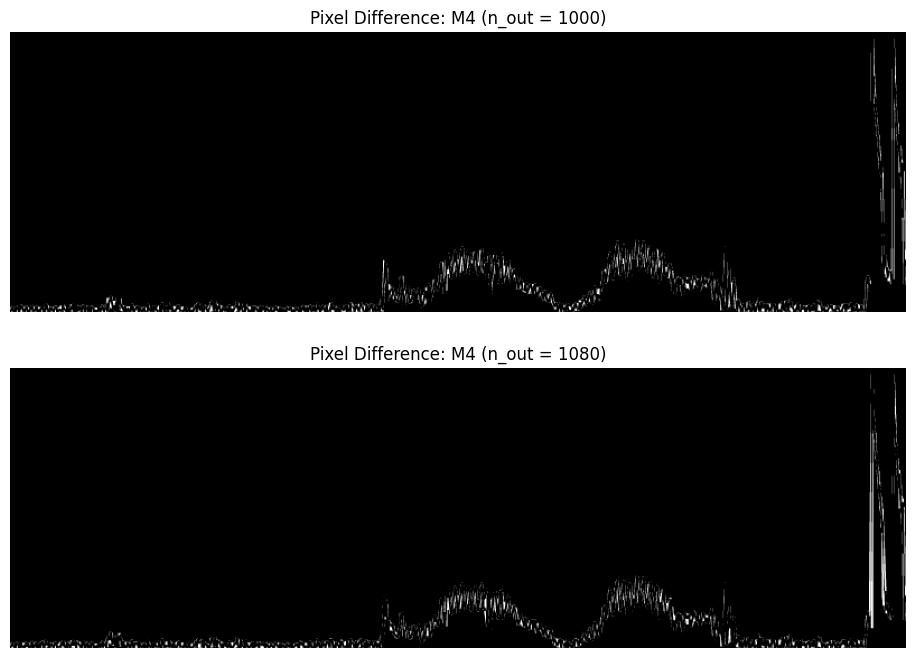

# Visual Representativity

This markdown file accompanies the interactive visualization of the `Visual Representativity` sectio of the paper with some insights and explanations.

`TODO`: 
- add a table of contents
- describe some terms (data efficiency, the Metrics, add the formula of the elbow)

### Image template grid & toolkit

All visualizations utilize a line-width of 2 and linear interpolation.

**insights**:
- the order of the trends is preserved among the different toolkits
- aliasing causes the `PEM_20` to drop significanly
    - the anti-aliased figures seem to staturate at a `PEM_20` of .0.1, which is caused by the shading differences between the anti-aliasedaggregation and reference images
- `LTTB` and `MinMax` seems to perform the best `TODO`
- There seems to be some instability in the M4 metrics for the `Ball-200k` dataset. 
    Analysis shows that is caused by the granularity of M4, slightly mismapping the reference image to the aggregated image. The screenshot below demonstrates that a lower n-out had a better mapping of this double peak at the end than a higher n_out (which utilized a lot of pixel space, hence it weighs a lot in the visual representativity metrics)
    

### Image template gride & line width

The employed toolkit is Plotly, using its default configurations i.e. a line width of 2 
and a linear interpolation. The metrics are computed using refrence images of the same line width.

**insights**:
- Increasing the line-width causes the metrics to decrease